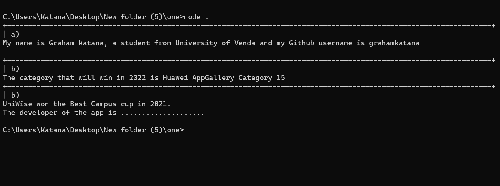

### To run this , ensure node js is installed.
no packages are required, type node . in your cmd to run all the function given




```Assessment:
The learner must write a Javascript application to achieve a function. Build Javascript programs that:

 

a) Log your information (names, institution, and Github username) into the console log with a statement that introduces you, e.g. “My name is Tsakane, a student from Xawe University of Technology and my Github username is ”

 

b) Roll a dice and help predict which category will win the MTN Business App of the Year in the year 2022.

 

c) Create, open, and read from a text file: Text content of an app that won the Best Campus Cup in 2021, its developer, category, and institution represented.